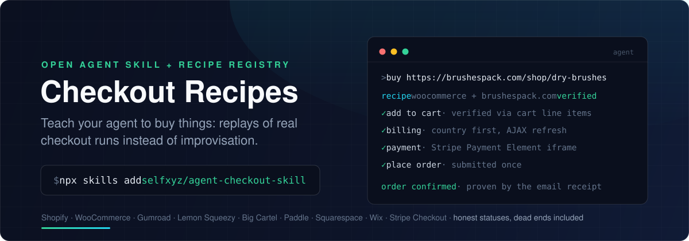

<p align="center">
  
</p>

<p align="center">
  <a href="https://github.com/selfxyz/agent-checkout-skill/actions/workflows/ci.yml"></a>
  <a href="LICENSE"></a>
</p>

Agents are still bad at buying things in a browser: popups, AJAX carts that
silently no-op, payment iframes, wallet-button traps, challenge walls. A
**checkout recipe** turns each solved site into a deterministic replay instead
of a re-improvisation: how to complete a real purchase, unattended, on an
e-commerce platform or a specific merchant.

This repo is that registry **packaged as an agent skill**. Install it and your
agent looks a site up before touching the cart, follows the recipe (each
carries an honest status, from receipt-proven `verified` down to never-run
`unverified`), and refuses cleanly on sites that can never work unattended.

## Install

```bash
npx skills add selfxyz/agent-checkout-skill
```

Works with Claude Code, Cursor, Codex, and 70+ other agents via
[skills.sh](https://skills.sh). Then just ask your agent to buy something:

> buy https://brushespack.com/shop/dry-brushes and stop before submitting payment

The skill ([`skills/checkout-recipes/SKILL.md`](skills/checkout-recipes/SKILL.md))
teaches it to query the live registry API for any URL, execute the matching
recipe phase by phase, hand off to a human on any 3DS/CAPTCHA challenge, and
contribute what it learned back.

No install needed to use the data: it's plain JSON, tied to no vendor:

```bash
curl -sG "https://clear-aardvark-944.convex.site/v1/recipes" \
  --data-urlencode "url=https://shop.example.com/product/thing"
```

## What's in a recipe

- **Platform recipes** (`recipes/platforms/*.json`): how a whole platform's
  checkout works (Shopify, WooCommerce+Stripe, Gumroad, Lemon Squeezy, …):
  detection fingerprints, the card-entry surface, per-phase steps, named
  selectors, gotchas.
- **Merchant recipes** (`recipes/merchants/*.json`): one store pinned down:
  which platform recipe applies, selector overrides discovered on a real run,
  dead-end classification (Turnstile, PayPal-only guest flow, …), and the
  verification trail.

Schema: [`schema/recipe.schema.json`](schema/recipe.schema.json).
Types: [`src/types.ts`](src/types.ts).

A complete merchant recipe (dead ends are first-class data):

```json
{
  "id": "astray3.bigcartel.com",
  "kind": "merchant",
  "hosts": ["astray3.bigcartel.com"],
  "platform": "bigcartel",
  "status": "dead-end",
  "lastVerifiedAt": "2026-07-20",
  "deadEnd": {
    "type": "paypal-only",
    "details": "Big Cartel store whose only gateway is PayPal; no card fields ever mount."
  },
  "notes": "Big Cartel itself supports Stripe; the dead-end is this store's gateway choice, not the platform's.",
  "exampleProductUrl": "https://astray3.bigcartel.com/product/3-x-3-vinyl-catapult-sticker"
}
```

## Honest statuses

The status field is the point of the registry. It is not aspirational:

| status | means |
| --- | --- |
| `verified` | a **real purchase** completed, proven **out-of-band** (merchant email receipt or card statement; a confirmation page is not proof). Requires `evidence` + `lastVerifiedAt`. Maintainer-gated. |
| `partial` | a real checkout was driven to a filled card form; no purchase completed. |
| `unverified` | derived from the platform's known structure; not yet run. |
| `dead-end` | unattended checkout is impossible here, and `deadEnd` says exactly why. |

Recording a dead end is as valuable as recording a success: it stops the next
agent wasting a run on a site that cannot work.

## Safety invariants (non-negotiable)

- Recipes fill **mock/placeholder payment tokens only**. A recipe never
  contains, requests, or reads back real card numbers, CVVs, or passwords.
- On a detected challenge (3DS / OTP / CAPTCHA): **stop and hand off to a
  human.** A recipe must never encode solving or bypassing a challenge; those
  are `dead-end` by design.
- Submit a payment **once**; classify the outcome instead of retrying a submit.

## Contributing

**Recipes are contributed through the API, not by pull request**: the skill's
step 4 is the whole flow. This repo is a read-only export of the live registry
(refreshed daily); recipe PRs here will be closed with a pointer to
[CONTRIBUTING.md](CONTRIBUTING.md). Skill, schema, tooling and docs PRs are
welcome.

Because these recipes are executed by autonomous agents, every submission is
screened automatically before it goes live (for text aimed at the reading
agent, challenge-evasion content, embedded personal or payment data, spam) and
combined with an existing recipe when it is the same store under another host.
[CONTRIBUTING.md](CONTRIBUTING.md#what-a-recipe-may-not-contain) lists exactly
what is rejected, and a rejection says which rule it broke.

## Working on the registry itself

```bash
bun install
bun run build     # -> dist/registry.json (full bundle) + dist/RECIPES.md
bun run validate  # schema + registry-wide invariants
bun test
```

`dist/RECIPES.md` is one agent-readable document containing every recipe,
handy to drop straight into a context window.

## Benchmark

An autonomy benchmark measures how far an agent gets across these recipes, and is
what upgrades a status to `verified`. It is not open source yet: it depends on a
Playwright SDK that is not published to npm. Both land here once that SDK ships.

## Provenance

Extracted from the `registry/` workspace of the closed-source monorepo that
maintains this data, with its git history preserved. That registry is now the
source of truth and this repo is its export; see
[Contributing](#contributing).

## License

MIT; see [LICENSE](LICENSE).
